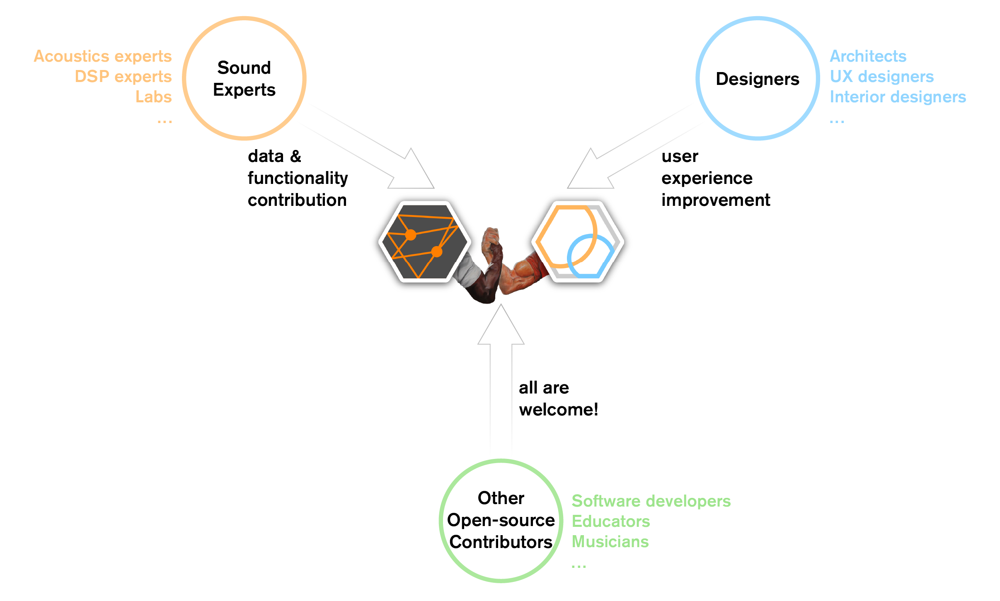

# Seiche & [PyRoomAcoustics](https://github.com/LCAV/pyroomacoustics) - Contributing

We are always accepting external contributions! We're looking for users who are interested in contributing code (GUI and app functionality) and/or material coefficients (for a public database).

Additionally, this project wouldn't be possible without [PyRoomAcoustics](https://github.com/LCAV/pyroomacoustics), which we use for performing acoustic simulations.
We highly suggest supporting PRA and contributing to them as well!

  

## Developing

### Issues

The Issues tab on GitHub contains a running list of features to implement, as well as any bugs or problems that arise from development.
For further details and discussions, please join our Discord server.

### Development Environment

The main development build is compiled in C++17 with OpenGL, Qt 6.10.2 and Eigen3 as dependencies. Qt 6.10.2 can be installed for free with a personal account on the [Qt6 website](https://doc.qt.io/qt-6/get-and-install-qt.html), and Eigen3 is automatically installed when compiling the software.

## Materials

We're also looking to expand our project into an open-source database of material coefficients. In the future, we want users to be able to drag-and-drop materials on different surfaces to improve the simulation process. Currently, we're still looking into the best way to store and share such material coefficients- there are several methods scattered around the acoustics and architecture communities. Feel free to send links to existing material databases to Evan or William.