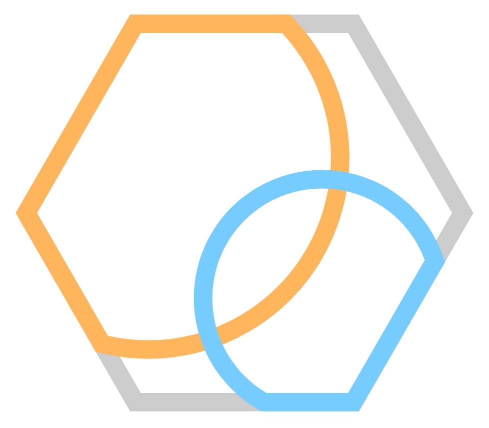
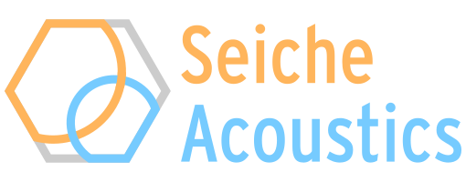
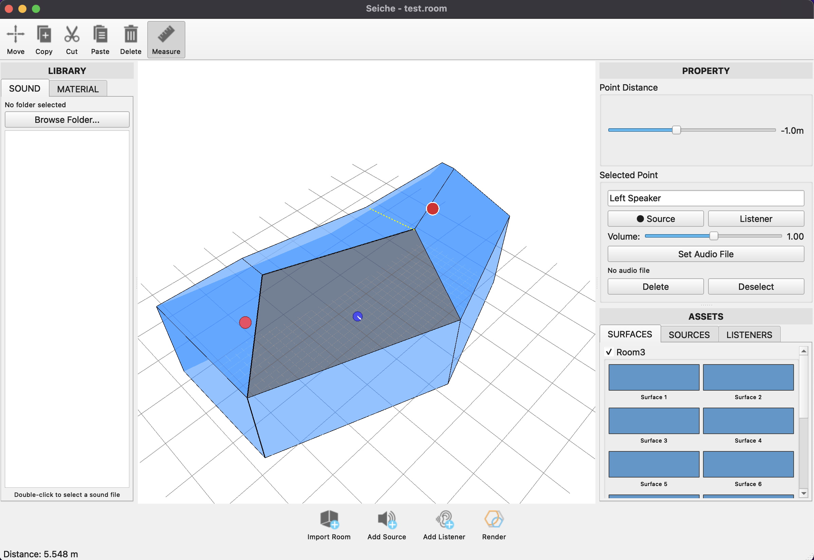
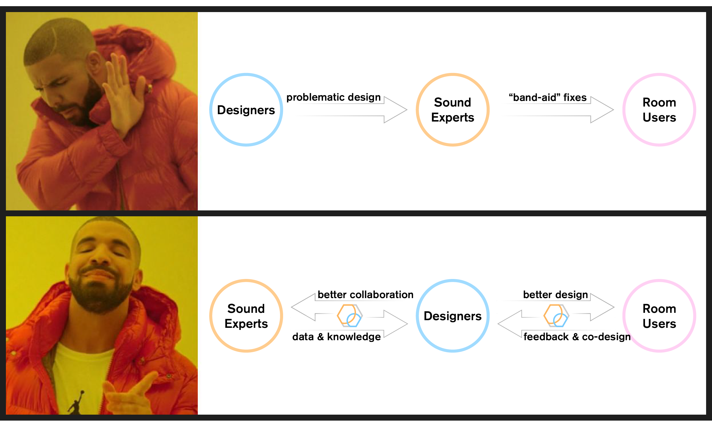

<!-- <p align="center">
  
  <p align="center"><b><font size=32px>PyRoomStudio</font></b></p>
</p> -->

<p align="center">
  
</p>

---
<!------------------------------------------------------------------->

**Seiche** is an open-source application for rendering and analyzing acoustical properties of 3D spaces via meshes. 
The project is inspired by [pyroomacoustics](https://github.com/LCAV/pyroomacoustics), a library for testing and simulating acoustics algorithms written by Robin Scheibler.

<p align="center">
  
</p>

## **Get Involved!**

#### [Discord](https://discord.gg/Q9ZtTcZZvH)

#### Contacts:

William (Zhiwen) Chen (willc@illinois.edu, [LinkedIn](https://www.linkedin.com/in/william-chen-821300149/)), *Co-Founder & Designer*

Evan M. Matthews (evanmm3@illinois.edu, [LinkedIn](https://www.linkedin.com/in/ematth)), *Co-Founder & Progammer*

<!------------------------------------------------------------------->

## Mission Statement

Seiche has two missions:

1. Make room acoustics design accessible and intuitive for designers via open-source software.
2. Connect people passionate about designing for the auditory sense, from both the technical and the creative sides.

By accomplishing these missions, we hope to increase the usage of acoustic tools in the design community and make light of sound as a necessary consideration for future spaces.

<p align="center">
  
</p>

## Setup

The latest build of Seiche is running on C++17 with Qt6 and Eigen3 dependencies.

### Distributable

### Self-Compiling


1. Clone the repository

    ```bash
    $ git clone https://github.com/SeicheAcoustics/Seiche.git
    ```

2. Install [Qt6](https://doc.qt.io/qt-6/qt-online-installation.html) (the open individual license is enough to compile the software). For windows installation, make sure to include the **MinGW** toolchain component under *Qt > Developer and Designer Tools*.

3. Compiling the software is done through Cmake/Ninja. The provided scripts are `build_windows.sh` and `build_macos.sh`, respectively, and will require slight tweaks to your respective Qt6 and compiler paths.

The version number can be different, although Qt >6 is expected. For MacOS specifically, replace `/mingw_64` with `/macos`.
Once Cmake has built the Ninja files, follow-up compilations will only need `cmake --build build`.

4. Run the `Seiche` executable.

```bash
$ ./build/Seiche # windows

$ ./build/Contents/MacOS/Seiche # MacOS
```

## Releasing

These scripts create a clean, upload-ready archive in `dist/` containing the app plus `materials/`.

### Windows

```bash
$ ./release_windows.sh
```

Optional clean rebuild:

```bash
$ ./release_windows.sh --fresh
```

### macOS

```bash
$ ./release_macos.sh
```

Optional clean rebuild:

```bash
$ ./release_macos.sh --fresh
```

### Linux

```bash
$ ./release_linux.sh
```

Optional clean rebuild:

```bash
$ ./release_linux.sh --fresh
```

<!------------------------------------------------------------------->

## Controls

Check `INSTRUCTIONS.md` for details on how to use the application.

<!------------------------------------------------------------------->

## Credits

- Big thanks to [Robin Scheibler](https://www.robinscheibler.org), [Zackery Belanger](https://empac.rpi.edu/program/people/researchers/zackery-belanger), [Mohamed Boubekri](https://arch.illinois.edu/people/profiles/mohamed-boubekri), and [Paris Smaragdis](https://www.mit.edu/~paris) for providing initial feedback and collaborating with us.

<!------------------------------------------------------------------->


